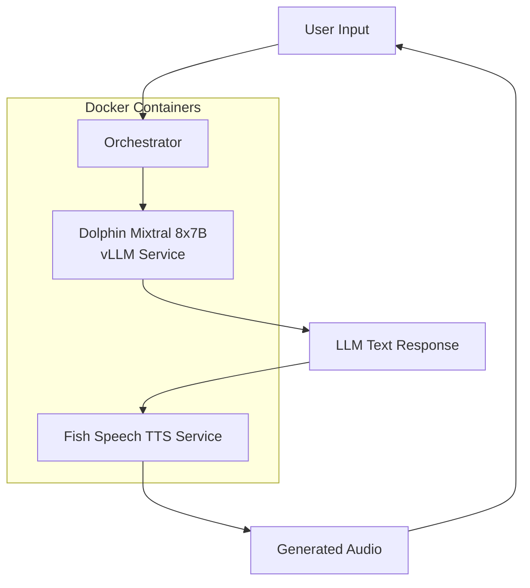

# LLM + Voice Cloning Docker Architecture

## Overview
Docker-based workflow for uncensored LLM (Dolphin Mixtral 8x7B) with voice cloning (Fish Speech). Designed for deployment on quickpod.io with 2× RTX 3090 for LLM and RTX 5060 Ti for TTS.

## Services

### 1. LLM Inference Service
- **Image**: `vllm/vllm-openai`
- **Model**: Dolphin Mixtral 8x7B (AWQ quantized)
- **API**: OpenAI‑compatible (`/v1/completions`, `/v1/chat/completions`)
- **GPU**: 2× RTX 3090 (tensor‑parallel)
- **Endpoint**: `http://llm:8000`
- **Environment**:
  - `MODEL`: `cognitivecomputations/dolphin-2.9.2-mistral-8x7b` (or appropriate AWQ variant)
  - `QUANTIZATION`: `awq`
  - `GPU_MEMORY_UTILIZATION`: `0.9`
  - `TENSOR_PARALLEL_SIZE`: `2`

### 2. Voice Cloning Service
- **Image**: `fishaudio/fish-speech`
- **Model**: Fish Speech S2 Pro (4B dual‑AR TTS)
- **API**: HTTP POST `/generate`
- **GPU**: RTX 5060 Ti
- **Endpoint**: `http://tts:8001`
- **Environment**:
  - `MODEL`: `fish-speech‑s2‑pro`
  - `DEVICE`: `cuda`
  - `VOICE_CLONING`: `true`

### 3. Orchestrator Service
- **Image**: Custom FastAPI (Python)
- **Role**: Accept user text, call LLM, call TTS, return audio stream
- **Endpoint**: `http://orchestrator:8002`
- **Endpoints**:
  - `POST /chat` – text‑in, audio‑out
  - `GET /health` – health check
- **Environment**:
  - `LLM_URL`: `http://llm:8000/v1`
  - `TTS_URL`: `http://tts:8001/generate`

## GPU Allocation

```yaml
llm:
  devices:
    - "0"
    - "1"
tts:
  devices:
    - "2"
```

## Network
Docker Compose internal network `llm‑voice‑net`. Services reachable via service names.

## Volume Mounts
- `./models/llm` – cached LLM weights (optional)
- `./models/tts` – cached TTS weights (optional)
- `./voices` – reference audio for voice cloning

## Deployment (Quickpod.io)
1. Clone repository onto quickpod.io instance.
2. Ensure NVIDIA Container Toolkit is installed.
3. Run `docker‑compose up --detach`.
4. Access orchestrator at `http://<instance‑ip>:8002`.

## Mermaid Diagram



## Model Details

### Dolphin Mixtral 8x7B AWQ
- **Parameters**: 47B (8×7B MoE), 26 GB VRAM after AWQ
- **Context**: 32 K tokens
- **Quantization**: AWQ (4‑bit)
- **Source**: Hugging Face `cognitivecomputations/dolphin‑2.9.2‑mixtral‑8x7b` (requires conversion to AWQ)
- **Alternative**: Pre‑quantized AWQ version from TheBloke (if available).

### Fish Speech S2 Pro
- **Parameters**: 4B dual‑AR
- **Capabilities**: Zero‑shot/few‑shot TTS, voice cloning
- **Language**: Chinese‑centric but supports multilingual
- **Inference**: Requires ~6 GB VRAM

## Next Steps
1. Create Dockerfile for LLM service (vLLM).
2. Create Dockerfile for TTS service (Fish Speech).
3. Implement orchestrator in FastAPI.
4. Write docker‑compose.yml with GPU mapping.
5. Test locally (if GPU available) or prepare quickpod.io deployment script.

---
*Last updated: $(date)*